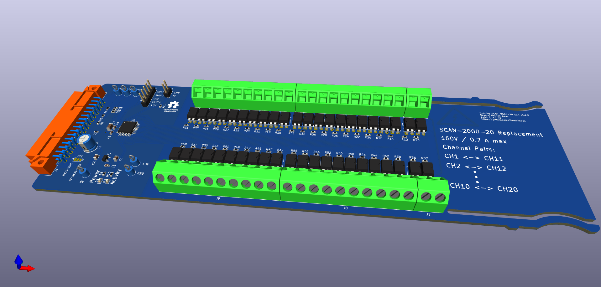
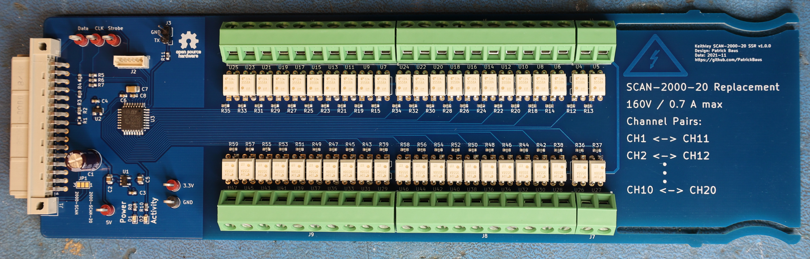

Keithley SCAN2000 SSR Replacement
===================

This repository contains the KiCAD PCB project files for a Keithley SCAN2000 replacement card. It uses solid-state relays instead of mechanical relays.

|DMM|Tested|Works|Note|
|--|--|--|--|
|[DMM6500](https://www.tek.com/en/products/keithley/digital-multimeter/dmm6500)|:heavy_check_mark:|:heavy_check_mark:||
|2000|:x:|:heavy_check_mark:|Not tested, but should work. The latest firmware seems to [support 20 channels](https://www.eevblog.com/forum/circuit-studio/example-project-20-channel-solid-state-scan-card-for-k2000-dmm/msg3101128/#msg3101128).|
|2000-20|:x:|:heavy_check_mark:|Not tested, but should work.|
|[2010](https://www.tek.com/en/products/keithley/digital-multimeter/2010-series)|:x:|:x:|Not tested, but should be the same as the Model 2002.|
|[2001](https://www.tek.com/en/products/keithley/digital-multimeter/2001-series)|:x:|:x:|Not tested, but should be the same as the Model 2002.|
|[2002](https://www.tek.com/en/products/keithley/digital-multimeter/2002-series)|:heavy_check_mark:|:x:|The serial clock of 2 MHz is too fast for the MCU.|

About
-----
The root folder contains the KiCAD files. The bill of materials can be found in the [/bom](bom/) folder, while the gerber files can be found in the [/gerber](gerber/) folder.

Description
-------------------
The design is based on the SCAN2000 pcb made by [George Christidis](https://github.com/macgeorge/SCAN2000STM32). It also uses an STM32G0, but the pcb design is done in [KiCAD 6](https://www.kicad.org/) and corrects several problems like incorrect dimensions of the original design and replaces hard to obtain parts like the resistor arrays. The card was tested in a Keithley DMM6500 and a Keithley Model 2002.

A photo of a version 1.0.0 board. Note: Later revisions have a pin header instead of the Picoblade connector for programming and the MCU is rotated.

Flashing the MCU
-------------------
The source code and installation instructions can be found [here](https://github.com/PatrickBaus/SCAN2000_Firmware). You will need a ST-Link adapter to flash the MCU.

Related Repositories
--------------------

See the following repositories for more information

KiCAD footprints: https://github.com/PatrickBaus/footprints.pretty

KiCAD 3D models: https://github.com/PatrickBaus/footprints.3dshapes

KiCAD schematic libraries: https://github.com/PatrickBaus/KiCad-libraries

License
-------
This work is released under the Cern OHL v.1.2 - see www.ohwr.org/licenses/cern-ohl/v1.2 or the included [LICENSE](LICENSE) file for more information.
