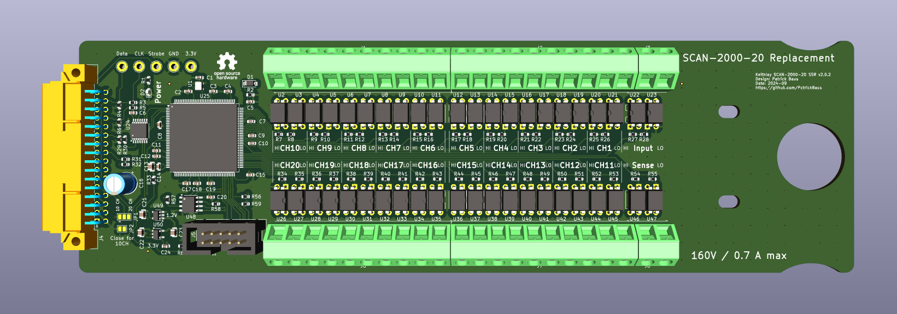

# Keithley 2000-SCAN SSR Replacement

This repository contains the KiCAD PCB project files for a [Keithley Model 2000-SCAN](https://download.tek.com/manual/2000SCAN-901-01_F-Jan-2014.pdf) replacement card. It uses solid-state relays instead of mechanical relays. See [below](#introduction) for a list of compatible devices. The design files can be found on the [releases](../../releases) page.

## Contents
- [Introduction](#introduction)
- [Design Files](#design-files)
- [Installation](#installation)
- [Related Repositories](#related-repositories)
- [Versioning](#versioning)
- [License](#license)

## Introduction
The design is based on the SCAN2000 PCB made by [George Christidis](https://github.com/macgeorge/SCAN2000STM32). It also uses an STM32G0, but the pcb design is done in [KiCAD 8](https://www.kicad.org/) and corrects several problems like incorrect dimensions of the original design and replaces hard to obtain parts like the resistor arrays. The advantage of solid state relays over conventional relays is the almost unlimited lifetime and immunitiy to wear.

The card was tested in a [Keithley DMM6500](https://www.tek.com/en/products/keithley/digital-multimeter/dmm6500) and a [Keithley Model 2002](https://www.tek.com/en/products/keithley/digital-multimeter/2002-series). The latter model is **not** supported by the card, because the serial clock to communicate with the card is clocked at 2 MHz and shared with other devices. These other devices do not use an 8-bit aligned protocol. The bus must therefore be sampled by the MCU and it is too slow for that. For more details, see the [serial_protocol](serial_protocol) folder as it contains a dump of the serial bus of a [Keithley Model 2002](https://www.tek.com/en/products/keithley/digital-multimeter/2002-series). The [Keithley Model 2010](https://www.tek.com/en/products/keithley/digital-multimeter/2010-series) and [Keithley Model 2001](https://www.tek.com/en/products/keithley/digital-multimeter/2001-series) were not tested, but they are similar to the [DMM6500](https://www.tek.com/en/products/keithley/digital-multimeter/dmm6500). Do report back if you have tested the card in such a model, so that I can tick those checkboxes.

|DMM|Tested|Note|
|--|--|--|
|[DMM6500](https://www.tek.com/en/products/keithley/digital-multimeter/dmm6500)|:heavy_check_mark:|Works.|
|[2000](https://www.tek.com/en/products/keithley/digital-multimeter/keithley-2000-series-6-digit-multimeter-scanning)|:x:|Not tested, but should work. The latest firmware seems to support [20 channels](https://www.eevblog.com/forum/circuit-studio/example-project-20-channel-solid-state-scan-card-for-k2000-dmm/msg3101128/#msg3101128).|
|[2000-20](https://www.tek.com/en/products/keithley/digital-multimeter/keithley-2000-series-6-digit-multimeter-scanning)|:x:|Not tested, but should work.|
|[2010](https://www.tek.com/en/products/keithley/digital-multimeter/2010-series)|:heavy_check_mark:|Works, but only 10 channels cards are supported by the firmware.|
|[2001](https://www.tek.com/en/products/keithley/digital-multimeter/2001-series)|:x:|Not tested, but should work.|
|[2002](https://www.tek.com/en/products/keithley/digital-multimeter/2002-series)|:heavy_check_mark:|Does not work. The serial clock is 2 MHz, which is too fast for the MCU.|

A photo of a version 1.0.0 board. Note: Later revisions have a pin header instead of the Picoblade connector for programming and the MCU is rotated.

## Design Files
The root folder contains the KiCAD files. The bill of materials can be found on the [releases](../../releases) page along with Gerber files for production.

## Installation
The source code and installation instructions can be found [here](https://github.com/PatrickBaus/SCAN2000_STM32_Firmware). You will need a ST-Link adapter to flash the MCU.

## Related Repositories
See the following repositories for more information as these are part of the [design files](#design-files).

- [KiCad footprints](https://github.com/PatrickBaus/footprints.pretty)
- [KiCAD 3D models](https://github.com/PatrickBaus/footprints.3dshapes)
- [KiCAD schematic libraries](https://github.com/PatrickBaus/KiCad-libraries)

## Versioning
I use [SemVer](http://semver.org/) for versioning. For the versions available, see the [tags](../../tags) available for this repository.

- MAJOR versions in this context mean a breaking change to the external interface of the hardware like different connectors or functions.
- MINOR versions contain changes to the hardware that only affect the inner workings of the circuit, but otherwise the performance is unaffected.
- PATCH versions do not affect the schematics or invalidate older bill of materials. These changes may include updated components (to replace obsolete parts for example), an updated silkscreen, or fixed typos.

## License
This work is released under the CERN-OHL-W
See [https://ohwr.org/cern_ohl_w_v2.pdf](https://ohwr.org/cern_ohl_w_v2.pdf) or the included LICENSE file for more information.
