# Keithley Model 2000-SCAN serial protocol
There are two versions of the scanner cards from Keithley for their range of DMMs discussed here, the [Model 2000-SCAN](https://download.tek.com/manual/2000SCAN-901-01_F-Jan-2014.pdf) and the newer [Model 2000-SCAN-20](https://download.tek.com/manual/2000-20-901-01C_Jul2003_Instruction.pdf). Additionally there are the [Model 2001-SCAN](https://download.tek.com/manual/2001_SCAN_901_01C.pdf) and [Model 2001-TCSCAN](https://download.tek.com/manual/2001-TCSCAN-900-01A_April_2018.pdf). Both are 10 channel cards as well. The [Model 2001-SCAN](https://download.tek.com/manual/2001_SCAN_901_01C.pdf) has 8 relays and 2 SSRs for high speed multiplexing. The [Model 2001-TCSCAN](https://download.tek.com/manual/2001-TCSCAN-900-01A_April_2018.pdf) on the other hand has 9 channels and one reference junction for old-junction compensated temperature measurements. The latter two will not be discussed here.

## Contents
- [Introduction](#introduction)
- [Model 2000-SCAN](#model-2000-scan)
- [Model 2000-SCAN-20](#model-2000-scan-20)
- [Exploring the data captures](#exploring-the-data-captures)

## Introduction
The schematics of the [Model 2000-SCAN](https://download.tek.com/manual/2000SCAN-901-01_F-Jan-2014.pdf) and the [Model 2000-SCAN-20](https://download.tek.com/manual/2000-20-901-01C_Jul2003_Instruction.pdf) cards can both be found online. Do note, that the latest version of the Model 2000-SCAN manual found on the Tektronix website does not contain the schematics any more. The last revision to contain them was Revision D from April 1999. Use a search engine to find it.

The ```Model 2000-SCAN``` and the ```Model 2000-SCAN-20``` use two different protocols. These were recorded with a [R&S RTH1004](https://www.rohde-schwarz.com/us/products/test-and-measurement/oscilloscopes/rs-scope-rider-handheld-oscilloscope_63493-156160.html) using its digital inputs. Additionally, the different multimeters use different timings which will also be dsicussed below.

## Model 2000-SCAN
The ```Model 2000-SCAN``` is the older 10 channel version of the scanner card and it works with all types of DMMs. The examples shown below were recorded with a [DMM6500](https://www.tek.com/en/products/keithley/digital-multimeter/dmm6500) and a [Model 2002](https://www.tek.com/en/products/keithley/digital-multimeter/2002-series) as the host machine.

### Commands
The data communication requires three data lines. The ```CLK``` line (```D0```), the ```DATA``` line (```D2```) and a ```LATCH```/```STROBE``` line (```D1```). For the 10 channel card the DMM transfers 2 blocks of 3 bytes of data and then triggers the ```LATCH``` pin after each block. In case of the [DMM6500](https://www.tek.com/en/products/keithley/digital-multimeter/dmm6500) all data lines idle ```low``` as can be seen here.
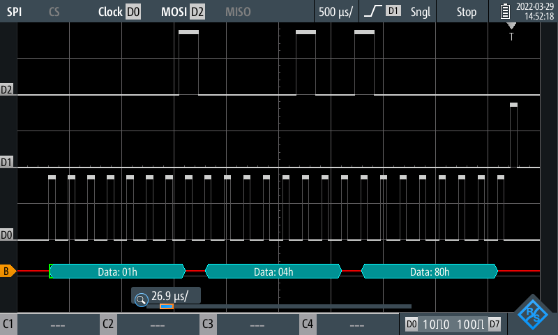

The [Model 2002](https://www.tek.com/en/products/keithley/digital-multimeter/2002-series) uses a slightly different approach where the ```CLK``` and ```DATA``` line idle ```high``` and only the ```LATCH``` line idles low.
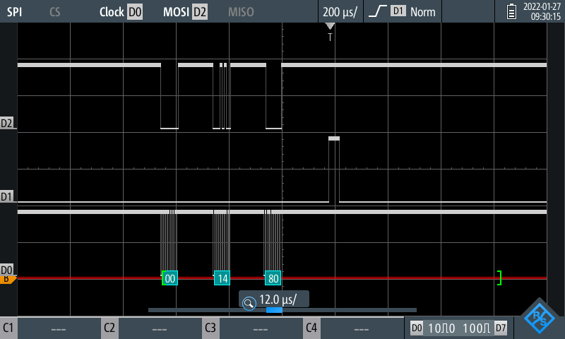

The protocol itself is a series bits where each bit correspondes to a relay either being opened or closed. This is due to the nature of the 2-coil latching relays (```Panasonic TQ2E-L2-5V```). Each of those coils is responsible for either closing the relay or opening it. 10 relays plus 1 relay to switch between 4W mode and 2W mode requires 22 bits to control, hence two fewer than 24 bits sent.

The decoded protocol ist shown here and can also verified using the schematic schown in the manual.

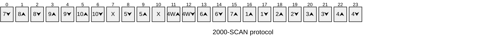

```⮟``` means closing the channel, ```⮝``` means opening the channel, ```X``` means do not care. These bits have no meaning as those pins of the latches on the PCB are not connected. See Pin Q8 of U101 (bit 7) and Q3 of U102 (bit 10).

Once the relay configuratoin is sent, the DMM then sends a series of zeroes to turn off the current to the relays. The [Model 2002](https://www.tek.com/en/products/keithley/digital-multimeter/2002-series) waits roughly ```2.8 ms``` between the datablock blocks

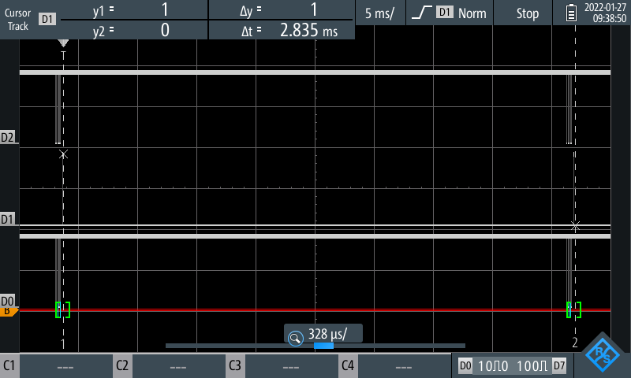

while the [DMM6500](https://www.tek.com/en/products/keithley/digital-multimeter/dmm6500) waits ```3.8 ms```

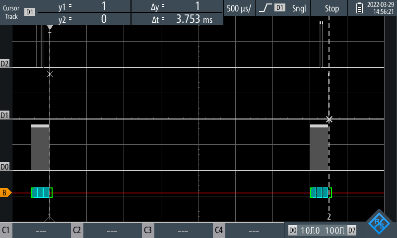

### Clock speed
The most striking difference between the [DMM6500](https://www.tek.com/en/products/keithley/digital-multimeter/dmm6500) and the [Model 2002](https://www.tek.com/en/products/keithley/digital-multimeter/2002-series) the is the data rate at which the signals are transferred. The clock frequency used by the [DMM6500](https://www.tek.com/en/products/keithley/digital-multimeter/dmm6500) is ```100 kHz```,


while the [Model 2002](https://www.tek.com/en/products/keithley/digital-multimeter/2002-series) uses a clock of ```2 MHz```
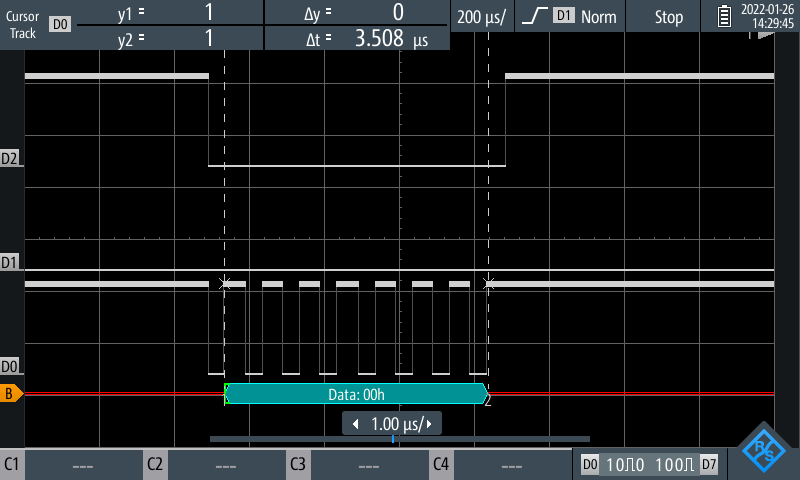

The reason for the fast clock speed of the [Model 2002](https://www.tek.com/en/products/keithley/digital-multimeter/2002-series) is simple. The bus of the [Model 2002](https://www.tek.com/en/products/keithley/digital-multimeter/2002-series) is used by multiple devices all talking on the same wire.

This can be seen here:
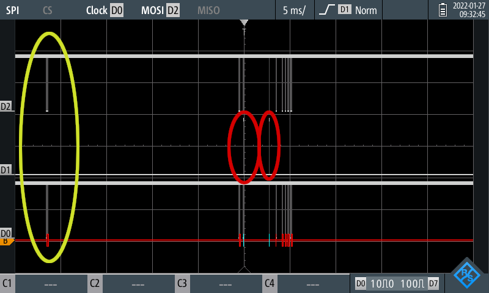

In yellow there is a data packet being transferred on the bus (```D0``` and ```D2```), but there is no ```LATCH``` pin (```D1```) activity. Later there more data packets coming on and in red the two ```LATCH``` signals (```D1```) can be seen. There are are at least two more devices active on that bus. One transfers at ```1 MHz``` clock speed


The other one is even slower and shows up as seemingly rogue bits on the ```CLK```/```D0``` line.


The image shows the two other devices on the bus. There is activity on the ```CLK```/```D0``` line with two different clock intervals. The lone pulse on the right side is the slow third device. This third device is the reason why using a standard microcontroller is not feasable. MCUs are aligned to a fixed number of clock cycles when reading the bus using their hardware peripherals. The extra clock pulse causes the hardware controller to desync. Sampling the bus in software is no feasable as well as the bus too fast at 2 MHz. Using latches, this is not a problem, as the last 24 bits before the ```LATCH``` signal comes in are saved.

## Model 2000-SCAN-20
The [Model 2000-SCAN-20](https://download.tek.com/manual/2000-20-901-01C_Jul2003_Instruction.pdf) is a more modern card which is only supported by [Model 2000](https://www.tek.com/en/products/keithley/digital-multimeter/keithley-2000-series-6-digit-multimeter-scanning) DMM and the [DMM6500](https://www.tek.com/en/products/keithley/digital-multimeter/dmm6500). The examples shown below were recorded with a [DMM6500](https://www.tek.com/en/products/keithley/digital-multimeter/dmm6500) as the host machine.

### Commands
The data communication also requires three data lines. The ```CLK``` line (```D0```), the ```DATA``` line (```D2```) and a ```LATCH```/```STROBE``` line (```D1```). The protocol is a bit more straight forward, even bits turn disconnect the relay, odd bits connect the relay. The 20 relays plus 1 relay for the 4W mode require 42 bits. This is being sent as 6 bytes.

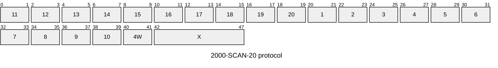

For example closing CH1 is sent as two blocks of ```0x00``` ```0x00``` ```0x00``` ```0x20``` ```0x00``` ```0x00``` (bit 21 is set) and ```0x00``` ```0x00``` ```0x00``` ```0x00``` ```0x00``` ```0x00```. The second block again turns all relay coils off. The second block is sent after ```3.8 ms```.

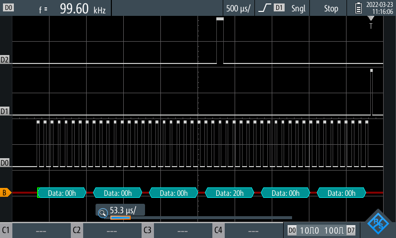 and

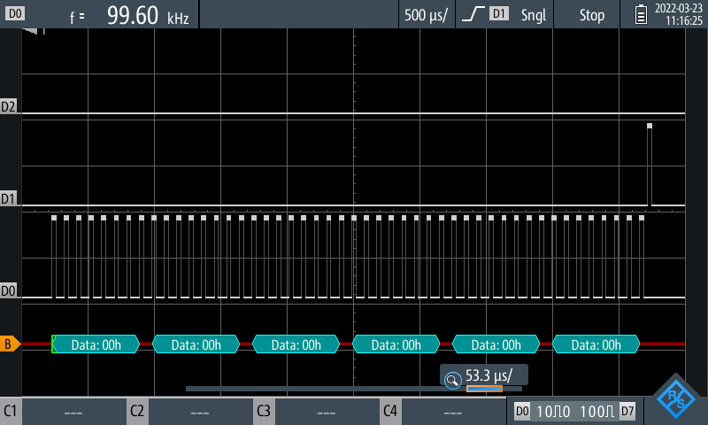


### Clock speed
The [DMM6500](https://www.tek.com/en/products/keithley/digital-multimeter/dmm6500) also clocks this bus at ```100 kHz```.

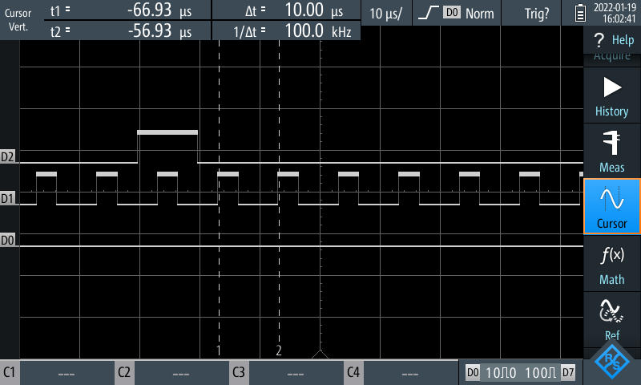

Do note, the ```CLK``` line is input channel ```D1``` and ```STROBE``` is ```D1``` in this capture.

## Exploring the data captures
This repository not only provides images, but also the raw data obtained using the [R&S RTH1004](https://www.rohde-schwarz.com/us/products/test-and-measurement/oscilloscopes/rs-scope-rider-handheld-oscilloscope_63493-156160.html). This data can be found in the [plots/](plots/) directory as a [csv file](https://en.wikipedia.org/wiki/Comma-separated_values) and can be plotted using your own plotter or the example [Python Matplotlib](https://matplotlib.org/) script provided. This section shows how to install the script.

### Installing dependencies
These instructions assume a Linux Bash shell and Python already installed on the system. Type the following commands into a shell in the [doc/plots/](plots/) directory.

```bash
python -m venv env/
source env/bin/activate
pip install - r requirements.txt
```

The plot script can now be executed using the following commands
```bash
source env/bin/activate
./plotter.py <plot_file>
```

The `source env/bin/activate` line can omitted if the virtual environment has already been activated. The ```<plot_file>``` can be any of the Python files provided in the subdirectories
